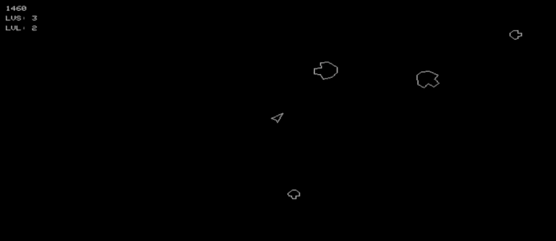
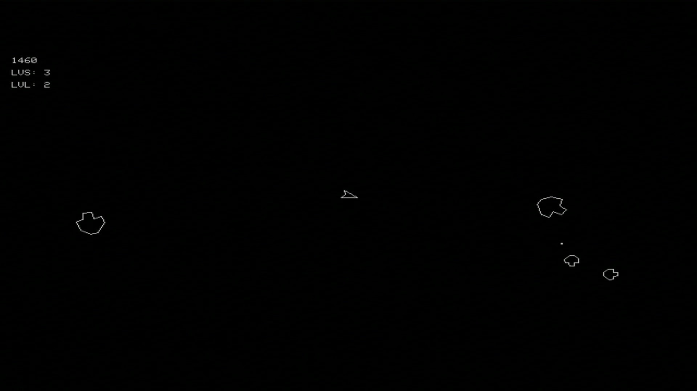

# RP6502 Asteroids

An Asteroids clone for the [Picocomputer RP6502](https://github.com/picocomputer/rp6502), written in C and compiled with [llvm-mos](https://llvm-mos.org/).

## Features

- Classic Asteroids gameplay.
- Vector-like graphics rendered using bitmap mode.
- Sound effects using the RP6502 PSG (via `ezpsg`).
- USB HID Keyboard support.

## Requirements

- **Firmware:** Compatible with RP6502 firmware version **0.15**.
- **Compiler:** [llvm-mos-sdk](https://github.com/picocomputer/vscode-llvm-mos) is required to build the project.

## Screenshots

